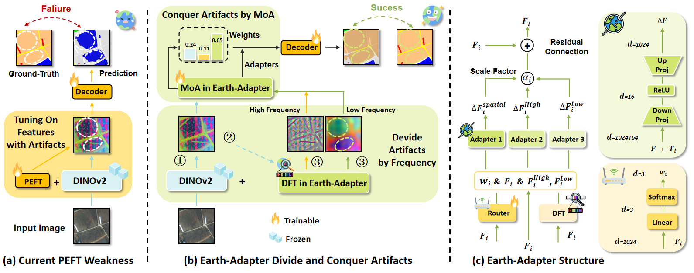

<p align="center">
  <h1 align="center">Earth-Adapter: Bridge the Geospatial Domain Gaps with Mixture of Frequency Adaptation</h1>
  <p align="center">
      <a href='https://scholar.google.com.hk/citations?user=zBM8_XkAAAAJ&hl=zh-CN&oi=ao' style='text-decoration: none' >Xiaoxing Hu</a><sup></sup>&emsp;
      <a href='https://scholar.google.com/citations?user=cWip8QgAAAAJ&hl=zh-CN' style='text-decoration: none' >Ziyang Gong</a><sup></sup>&emsp;  
      <a href='https://scholar.google.com/citations?user=3nMDEBYAAAAJ&hl=zh-CN&oi=ao' style='text-decoration: none' >Yupei Wang</a><sup></sup>&emsp;  
      <a href='https://scholar.google.com/citations?user=62c9GI0AAAAJ&hl=zh-CN&oi=ao' style='text-decoration: none' >Yuru Jia</a><sup></sup>&emsp;<br>
      <a href='https://scholar.google.com/citations?user=EyZqU9gAAAAJ&hl=zh-CN&oi=ao' style='text-decoration: none' >Gen Luo</a><sup></sup>&emsp;
      <a href='https://yangxue0827.github.io/' style='text-decoration: none' >Xue Yang</a><sup></sup>&emsp;
      <!-- <h3 align='center'>CVPR 2025</h3> -->
      <div align="center">
      <!-- <!-- <a href='https://arxiv.org/abs/2501.04440'></a> -->
      <!-- <a href='https://github.com/zhasion/RSAR'></a>
      <a href='https://drive.google.com/file/d/1v-HXUSmwBQCtrq0MlTOkCaBQ_vbz5_qs/view?usp=sharing'></a> -->
      <!-- <a href='https://pan.baidu.com/s/1DVUNBuWrhJRg0H1qhwtfEQ?pwd=rsar'></a>
      <!-- <a href='https://zhuanlan.zhihu.com/p/16758735545'></a> -->
	  </div>
    <p align='center'>
        If you find our work helpful, please consider giving us a ⭐!
    </p>
   </p>
</p>

<!-- [](https://arxiv.org/abs/XXXX.XXXXX)
[](LICENSE) -->

Official PyTorch implementation of [Earth Adapter: Bridge the Geospatial Domain Gaps with Mixture of Frequency Adaptation]

<div align="center">
  
</div>


## Notice
This repository is still being organized and refined. If you encounter any issues while using it, please contact |Email: xiaoxinghhh@gmail.com|WeChat: 15717699268| or submit an issue. Thank you for your attention.

## TODO
- [x] complete training and evaluation instruction
- [x] paper link
- [ ] demo.ipynb
- [x] data and weight on huggingface & google drive
- [ ] extended experiment on supervised in-domain semantic segmentation
- [ ] extended experiment on cross-earth benchmark
- [ ] bug fix...

## 📖 Introduction

This repository contains the official implementation of [Earth Adapter: Bridge the Geospatial Domain Gaps with Mixture of Frequency Adaptation]. Our method achieves state-of-the-art performance on 8 widely-used cross-domain geospatial benchmarks. The code is still under development, and we are currently providing the model, weights, and dataset.

Paper: [Paper Link](http://arxiv.org/abs/2504.06220)

## 🛠️ Requirements

- Python >= 3.8
- PyTorch >= 1.10
- CUDA >= 11.0 (if using GPU)
- Other dependencies in `requirements.txt`

## 🚀 Installation

- Clone this repository and install dependencies:

```bash
# Clone the repo
git clone https://github.com/VisionXLab/Earth-Adapter.git
cd Earth-Adapter

# Create virtual environment
conda create -n earth-adapter python=3.9 -y

conda install pytorch==2.0.1 torchvision==0.15.2 torchaudio==2.0.2 pytorch-cuda=11.7 -c pytorch -c nvidia -y
pip install -U openmim
mim install mmengine
mim install "mmcv>=2.0.0"
pip install "mmsegmentation>=1.0.0"
pip install "mmdet>=3.0.0"
pip install xformers=='0.0.20'
pip install -r requirements.txt
pip install future tensorboard
```

## 📂 Dataset Preparation


- Download the LoveDA, ISPRS Potsdam, ISPRS Vaihingen at the |[Baidu Cloud](https://pan.baidu.com/s/1WGoVqLuJTJXc2AVDyBxXYQ?pwd=s6rk)|[Hugging Face](https://huggingface.co/datasets/wsdwJohn1231/Geo_dataset)|[Google Drive](https://drive.google.com/drive/folders/1mybm0u8TWV25xG4b0nN-ehIMse84j9XK?usp=sharing)| (We have processed the images and labels, dividing them into 512x512 patches. You may also perform the same processing on your own dataset.)
- Construct the data as follows:

```bash
Earth-Adapter/
|-- data/
|---|--- loveda_uda
|---|--- potsdamRGB
|---|--- vaihingen
```

## 🔥 Usage

### Training

```bash
./tools/train.sh
```

### Evaluation
The Checkpoint can be downloaded from |[Baidu Cloud](https://pan.baidu.com/s/1vZm9VvSgRmPeXfu-21nudA?pwd=ys74)|[Hugging Face](https://huggingface.co/wsdwJohn1231/Earth-Adapter)|[Google Drive](https://drive.google.com/drive/folders/1UnOOYtGV6jJi39TSnzsPowZK5z-CdZ8K?usp=sharing)|,put the checkpoint in the `checkpoints` folder. Then run:
```bash
./tools/test.sh
```
<!-- 
To evaluate the trained model, run:

```bash
python eval.py --checkpoint path/to/checkpoint.pth
```

### Demo

To run inference on a single image:

```bash
python demo.py --input path/to/image.jpg --output path/to/output.jpg
```

## 📊 Results

### Quantitative Results

| Method        | Dataset | Accuracy | mIoU |
|--------------|--------|----------|------|
| Our Method   | XYZ    | XX.X%    | XX.X% |
| Baseline     | XYZ    | XX.X%    | XX.X% |

### Qualitative Results

Example predictions:


--> 
## 📜 Citation

If you find our work helpful, please cite our paper:

```bibtex
@article{hu2025earth,
  title={Earth-Adapter: Bridge the Geospatial Domain Gaps with Mixture of Frequency Adaptation},
  author={Hu, Xiaoxing and Gong, Ziyang and Wang, Yupei and Jia, Yuru and Luo, Gen and Yang, Xue},
  journal={arXiv preprint arXiv:2504.06220},
  year={2025}
}
@article{gong2024crossearth,
  title={Crossearth: Geospatial vision foundation model for domain generalizable remote sensing semantic segmentation},
  author={Gong, Ziyang and Wei, Zhixiang and Wang, Di and Ma, Xianzheng and Chen, Hongruixuan and Jia, Yuru and Deng, Yupeng and Ji, Zhenming and Zhu, Xiangwei and Yokoya, Naoto and others},
  journal={arXiv preprint arXiv:2410.22629},
  year={2024}
}
```

## 📝 License

This project is licensed under the MIT License - see the [LICENSE](LICENSE) file for details.

## 🙌 Acknowledgments

Our work is inspired by [Rein](https://github.com/w1oves/Rein). We are grateful for their outstanding work and code.
